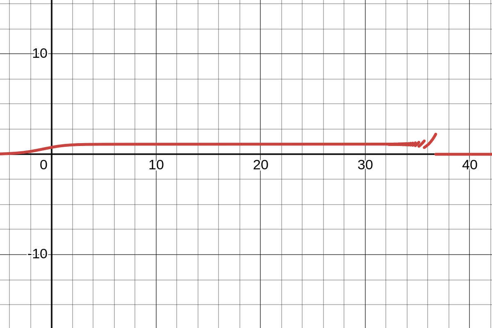

# Sprawozdanie

## Zadanie 1

### 1.1 Opis i Rozwiązanie
Zadanie polega na powtórzeniu eksperymentu z zadania 5 z listy 1 (wykorzystaniu czterech algorytmów sumowania do obliczenia iloczynu skalarnego dwóch wektorów) przy wprowadzeniu niewielkich zmian w wektorze x. Wektory x, y z poprzedniej listy:

$x = [2.718281828, −3.141592654, 1.414213562, 0.5772156649, 0.3010299957]$

$y = [1486.2497, 878366.9879, −22.37492, 4773714.647, 0.000185049]$.

Zmodyfikowany wektor $x'$:

$x' = [2.718281828, −3.141592654, 1.414213562, 0.5772156649, 0.3010299957]$

Rozwiązanie znajduje się w pliku task1.jl.

### 1.2 Wyniki

| Algorytm |   Float32 (oryginalny $x$)   |   Float32 (zmodyfikowany $x'$)   |
| :------: | ---------------------: | ----------------------: |
|     a    | $-0.4999442994594573975$ | $-0.4999442994594573975$ |
|     b    | $-0.4543457031250000000$ | $-0.4543457031250000000$ |
|     c    | $-0.5000000000000000000$ | $-0.5000000000000000000$ |
|     d    | $-0.5000000000000000000$ | $-0.5000000000000000000$ |

| Algorytm |          Float64 (oryginalny $x$)         |         Float64 (zmodyfikowany $x'$)         |
| :------: | -----------------------------------: | ----------------------------------: |
|     a    |  $1.025188136829667182\times10^{-10}$ | $-4.296342739891585369\times10^{-3}$ |
|     b    | $-1.564330887049436569\times10^{-10}$ | $-4.296342998713953421\times10^{-3}$ |
|     c    |         $0.000000000000000000$        | $-4.296342842280864716\times10^{-3}$ |
|     d    |         $0.000000000000000000$        | $-4.296342842280864716\times10^{-3}$ |

### 1.3 Wnioski

Float32 w tym przykładzie „zatopił” perturbację zaokrągleniami — wynik nie zmienił się widocznie. Float64 był wystarczająco precyzyjny, by wykryć różnicę i wynik przesunął się o ~$4.3×10^{−3}$.

Drobna zmiana danych znacząco zmieniła wynik iloczynu skalarnego $x'\cdot y$ względem $x\cdot y$. Możemy więc wywnioskować, że zadanie obliczenia iloczynu skalarnego dla tych danych jest źle uwarunkowane.

## Zadanie 2

### 2.1 Opis
Zadanie polega na wykorzystaniu co najmniej dwóch programów do wizualizacji do narysowania funkcji $f(x) = e^xln(1 + e^{−x})$ oraz na obliczeniu granicy funkcji przy $x\rightarrow \infty$.

### 2.2 Rozwiązanie

Rysunek 1: Wizualizacja funkcji $f$ z użyciem kalkulatora graficznego Desmos

.png)
Rysunek 2: Wizualizacja funkcji $f$ z użyciem kalkulatora graficznego Geogebra

Obliczenie granicy funkcji $f$:

$\lim_{x\to\infty} e^x\ln(1+e^{-x})
= \lim_{x\to\infty}\frac{\ln(1+e^{-x})}{e^{-x}}
\ \xlongequal{\text{(forma }0/0\text{)}}\
\xlongequal{\text{l'Hopital}}
\lim_{x\to\infty}\frac{\dfrac{d}{dx}\ln(1+e^{-x})}{\dfrac{d}{dx}e^{-x}}
= \lim_{x\to\infty}\frac{-e^{-x}/(1+e^{-x})}{-e^{-x}}
= \lim_{x\to\infty}\frac{1}{1+e^{-x}}
= \frac{1}{1+0}=1$

### 2.3 Wnioski

Obserwacja: na kalkulatorach graficznych funkcja wygląda najpierw jak zbliżająca się do 1, potem pojawiają się oscylacje, a w końcu wykres „spada” do 0.
Dla dużych $x$ wartości $e^{x}$ stają się bardzo duże (możliwe przepełnienie), a $e^{-x}$ — bardzo małe (możliwe podpełnienie).
Gdy $e^{-x}$ podpełnia do $0$, $\ln(1+e^{-x})$ przyjmuje wartość $0$ i mnożenie przez (zawodny) $e^x$ może dać $0$ lub NaN/Inf — stąd skoki i „oscylogramy”.
Dodatkowo rzadkie próbkowanie punktów i łączenie ich liniami na wykresie potęguje artefakty (widoczne oscylacje).

