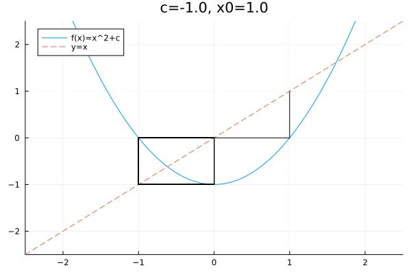

<h1 style="text-align:center;">Sprawozdanie z Listy nr 2</h1>

Sara Żyndul

279686

## Zadanie 1

### 1.1 Opis i Rozwiązanie
Zadanie polega na powtórzeniu eksperymentu z zadania 5 z listy 1 (wykorzystaniu czterech algorytmów sumowania do obliczenia iloczynu skalarnego dwóch wektorów) przy wprowadzeniu niewielkich zmian w wektorze x. Wektory x, y z poprzedniej listy:

$x = [2.718281828, −3.141592654, 1.414213562, 0.5772156649, 0.3010299957]$

$y = [1486.2497, 878366.9879, −22.37492, 4773714.647, 0.000185049]$.

Zmodyfikowany wektor $x'$:

$x' = [2.718281828, −3.141592654, 1.414213562, 0.5772156649, 0.3010299957]$

Rozwiązanie znajduje się w pliku task1.jl.

### 1.2 Wyniki

| Algorytm |   Float32 (oryginalny $x$)   |   Float32 (zmodyfikowany $x'$)   |
| :------: | ---------------------: | ----------------------: |
|     a    | $-0.4999442994594573975$ | $-0.4999442994594573975$ |
|     b    | $-0.4543457031250000000$ | $-0.4543457031250000000$ |
|     c    | $-0.5000000000000000000$ | $-0.5000000000000000000$ |
|     d    | $-0.5000000000000000000$ | $-0.5000000000000000000$ |

| Algorytm |          Float64 (oryginalny $x$)         |         Float64 (zmodyfikowany $x'$)         |
| :------: | -----------------------------------: | ----------------------------------: |
|     a    |  $1.025188136829667182\times10^{-10}$ | $-4.296342739891585369\times10^{-3}$ |
|     b    | $-1.564330887049436569\times10^{-10}$ | $-4.296342998713953421\times10^{-3}$ |
|     c    |         $0.000000000000000000$        | $-4.296342842280864716\times10^{-3}$ |
|     d    |         $0.000000000000000000$        | $-4.296342842280864716\times10^{-3}$ |

### 1.3 Wnioski

Float32 w tym przykładzie „zatopił” perturbację zaokrągleniami — wynik nie zmienił się widocznie. Float64 był wystarczająco precyzyjny, by wykryć różnicę i wynik przesunął się o ~$4.3×10^{−3}$.

Drobna zmiana danych znacząco zmieniła wynik iloczynu skalarnego $x'\cdot y$ względem $x\cdot y$. Możemy więc wywnioskować, że zadanie obliczenia iloczynu skalarnego dla tych danych jest źle uwarunkowane.

## Zadanie 2

### 2.1 Opis
Zadanie polega na wykorzystaniu co najmniej dwóch programów do wizualizacji do narysowania funkcji $f(x) = e^xln(1 + e^{−x})$ oraz na obliczeniu granicy funkcji przy $x\rightarrow \infty$.

### 2.2 Rozwiązanie

Rysunek 1: Wizualizacja funkcji $f$ z użyciem kalkulatora graficznego Desmos

.png)
Rysunek 2: Wizualizacja funkcji $f$ z użyciem kalkulatora graficznego Geogebra

Obliczenie granicy funkcji $f$:

$\lim_{x\to\infty} e^x\ln(1+e^{-x})
= \lim_{x\to\infty}\frac{\ln(1+e^{-x})}{e^{-x}}
\ \xlongequal{\text{(forma }0/0\text{)}}\
\xlongequal{\text{l'Hopital}}
\lim_{x\to\infty}\frac{\dfrac{d}{dx}\ln(1+e^{-x})}{\dfrac{d}{dx}e^{-x}}
= \lim_{x\to\infty}\frac{-e^{-x}/(1+e^{-x})}{-e^{-x}}
= \lim_{x\to\infty}\frac{1}{1+e^{-x}}
= \frac{1}{1+0}=1$

### 2.3 Wnioski

Obserwacja: na kalkulatorach graficznych funkcja wygląda najpierw jak zbliżająca się do 1, potem pojawiają się oscylacje, a w końcu wykres „spada” do 0.
Dla dużych $x$ wartości $e^{x}$ stają się bardzo duże (możliwe przepełnienie), a $e^{-x}$ — bardzo małe (możliwe podpełnienie).
Gdy $e^{-x}$ podpełnia do $0$, $\ln(1+e^{-x})$ przyjmuje wartość $0$ i mnożenie przez (zawodny) $e^x$ może dać $0$ lub NaN/Inf — stąd skoki i „oscylogramy”.
Dodatkowo rzadkie próbkowanie punktów i łączenie ich liniami na wykresie potęguje artefakty (widoczne oscylacje).

## Zadanie 3

### 3.1 Opis

Zadanie polega na rozwiązaniu układów $Ax=b$ dla dwóch rodzin macierzy: Hilberta $H_n$ dla rosnącego $n$ oraz losowych macierzy $R_n$ wygenerowanych z zadanym wskaźnikiem uwarunkowania $c$. Dla każdej macierzy rozwiązano układ dwoma metodami: `A\b` oraz `inv(A)*b`. Porównano otrzymane wektory z rozwiązaniem dokładnym, licząc względne błędy $\mathrm{rel}_2$, oraz sprawdzono $\operatorname{cond}(A)$ i $\operatorname{rank}(A)$.

### 3.2 Wyniki
|  $n$ | $\operatorname{cond}(A)$ | $\operatorname{rank}(A)$ | $\mathrm{rel}_2(A\backslash b)$ | $\mathrm{rel}_2(\mathrm{inv}(A)\cdot b)$ |
| ---: | :----------------------- | -----------------------: | :------------------------------ | :--------------------------------------- |
|  $2$ |      $1.928\times10^{1}$ |                      $2$ |           $5.661\times10^{-16}$ |                    $1.404\times10^{-15}$ |
|  $3$ |      $5.241\times10^{2}$ |                      $3$ |           $8.023\times10^{-15}$ |                                      $0$ |
|  $4$ |      $1.551\times10^{4}$ |                      $4$ |           $4.137\times10^{-14}$ |                                      $0$ |
|  $5$ |      $4.766\times10^{5}$ |                      $5$ |           $1.683\times10^{-12}$ |                    $3.354\times10^{-12}$ |
|  $6$ |      $1.495\times10^{7}$ |                      $6$ |           $2.619\times10^{-10}$ |                    $2.016\times10^{-10}$ |
|  $7$ |      $4.754\times10^{8}$ |                      $7$ |            $1.261\times10^{-8}$ |                     $4.713\times10^{-9}$ |
|  $8$ |     $1.526\times10^{10}$ |                      $8$ |            $6.124\times10^{-8}$ |                     $3.077\times10^{-7}$ |
|  $9$ |     $4.932\times10^{11}$ |                      $9$ |            $3.875\times10^{-6}$ |                     $4.541\times10^{-6}$ |
| $10$ |     $1.602\times10^{13}$ |                     $10$ |            $8.670\times10^{-5}$ |                     $2.501\times10^{-4}$ |
| $11$ |     $5.223\times10^{14}$ |                     $10$ |            $1.583\times10^{-4}$ |                     $7.618\times10^{-3}$ |
| $12$ |     $1.761\times10^{16}$ |                     $11$ |            $1.340\times10^{-1}$ |                     $2.590\times10^{-1}$ |
|$13$ | $3.191\times10^{18}$ | $11$ | $1.104\times10^{-1}$ | $5.331$ |
|$14$ | $9.276\times10^{17}$ | $11$ | $1.455$ | $8.715$ |
|$15$ | $3.676\times10^{17}$ | $12$ | $4.697$ | $7.345$ |

**Tabela 1 — Macierze Hilberta**

$n$ — rozmiar macierzy Hilberta $H_n$.

$\operatorname{cond}(A)$ — zmierzony wskaźnik uwarunkowania w normie 2

$\operatorname{rank}(A)$ — rząd (liczba liniowo niezależnych kolumn); wartości mniejsze niż $n$ wskazują na utratę rzędu numerycznego.

$\mathrm{rel}_2(A\backslash b)$ i $\mathrm{rel}_2(\mathrm{inv}(A)\cdot b)$ — względne błędy w normie 2 dla dwóch metod rozwiązania (kolejno: $A\backslash b$, $\mathrm{inv}(A)\cdot b$).

Interpretacja: rosnące $\operatorname{cond}(A)$ koreluje z narastaniem błędu; $A\backslash b$ zwykle daje mniejsze błędy niż $\mathrm{inv}(A)\cdot b$.

|  $n$ | $c$ | $\operatorname{cond}(A)$ | $\operatorname{rank}(A)$ | $\mathrm{rel}_2(A\backslash b)$ | $\mathrm{rel}_2(\mathrm{inv}(A)\cdot b)$ |
| ---: | :--- | :------------------------------ | -----------------------: | :----------------------- | :------------------------------ |
|  $5$ |     $1.0\times10^{0}$ | $1.000\times10^{0}$ |                      $5$ |           $2.483\times10^{-16}$ |                    $2.627\times10^{-16}$ |
|  $5$ |     $1.0\times10^{1}$ | $1.000\times10^{1}$ |                      $5$ |           $9.930\times10^{-17}$ |                    $1.404\times10^{-16}$ |
|  $5$ |     $1.0\times10^{3}$ | $1.000\times10^{3}$ |                      $5$ |           $2.693\times10^{-14}$ |                    $2.883\times10^{-14}$ |
|  $5$ |     $1.0\times10^{7}$ | $1.000\times10^{7}$ |                      $5$ |           $2.983\times10^{-10}$ |                    $2.855\times10^{-10}$ |
|  $5$ |   $1.0\times10^{12}$ | $1.000\times10^{12}$ |                      $5$ |            $4.297\times10^{-6}$ |                     $5.327\times10^{-6}$ |
|  $5$ |   $1.0\times10^{16}$ | $1.633\times10^{16}$ |                      $4$ |            $1.036\times10^{-1}$ |                     $9.607\times10^{-2}$ |
| $10$ |     $1.0\times10^{0}$ | $1.000\times10^{0}$ |                     $10$ |           $2.107\times10^{-16}$ |                    $2.979\times10^{-16}$ |
| $10$ |     $1.0\times10^{1}$ | $1.000\times10^{1}$ |                     $10$ |           $2.107\times10^{-16}$ |                    $2.432\times10^{-16}$ |
| $10$ |     $1.0\times10^{3}$ | $1.000\times10^{3}$ |                     $10$ |           $2.776\times10^{-15}$ |                    $6.723\times10^{-15}$ |
| $10$ |     $1.0\times10^{7}$ | $1.000\times10^{7}$ |                     $10$ |           $1.723\times10^{-10}$ |                    $9.155\times10^{-11}$ |
| $10$ |   $1.0\times10^{12}$ | $1.000\times10^{12}$ |                     $10$ |            $3.408\times10^{-6}$ |                     $5.117\times10^{-6}$ |
| $10$ |   $1.0\times10^{16}$ | $1.220\times10^{16}$ |                      $9$ |            $2.678\times10^{-1}$ |                     $1.065\times10^{-1}$ |
| $20$ |     $1.0\times10^{0}$ | $1.000\times10^{0}$ |                     $20$ |           $5.166\times10^{-16}$ |                    $3.846\times10^{-16}$ |
| $20$ |     $1.0\times10^{1}$ | $1.000\times10^{1}$ |                     $20$ |           $5.601\times10^{-16}$ |                    $5.027\times10^{-16}$ |
| $20$ |     $1.0\times10^{3}$ | $1.000\times10^{3}$ |                     $20$ |           $4.817\times10^{-15}$ |                    $4.037\times10^{-15}$ |
| $20$ |     $1.0\times10^{7}$ | $1.000\times10^{7}$ |                     $20$ |           $2.362\times10^{-10}$ |                    $2.207\times10^{-10}$ |
| $20$ |   $1.0\times10^{12}$ | $9.999\times10^{11}$ |                     $20$ |            $3.343\times10^{-7}$ |                     $5.245\times10^{-6}$ |
| $20$ |   $1.0\times10^{16}$ | $6.226\times10^{15}$ |                     $19$ |            $4.816\times10^{-2}$ |                     $5.241\times10^{-2}$ |

**Tabela 2 — Macierze losowe**

$n$ — rozmiar macierzy losowej.

$c$ — zadany współczynnik uwarunkowania użyty przy generowaniu macierzy.

$\operatorname{cond}(A)$ — zmierzony wskaźnik uwarunkowania macierzy (może różnić się od żądanego z powodu ograniczeń precyzji).

$\operatorname{rank}(A)$ — rząd macierzy (sprawdza, czy następuje utrata rzędu numerycznego przy bardzo dużym $c$).

$\mathrm{rel}_2(A\backslash b)$ i $\mathrm{rel}_2(\mathrm{inv}(A)\cdot b)$ — względne błędy w normie 2 dla dwóch metod rozwiązania (kolejno: $A\backslash b$, $\mathrm{inv}(A)\cdot b$).

Interpretacja: rosnące $c$  prowadzi do wzrostu $\operatorname{cond}(A)$ i błędów; przy ekstremalnych $c$ może wystąpić spadek rzędu i znaczne pogorszenie dokładności.

### 3.3 Wnioski

1. Dla macierzy Hilberta błąd rośnie bardzo szybko wraz ze wzrostem $n$ — problem staje się silnie źle uwarunkowany (w tabeli już od $n\approx10$ widać wyraźny wzrost błędów).
2. `A\b` daje zwykle mniejsze błędy niż `inv(A)*b` — odwracanie macierzy jest mniej stabilne numerycznie.
3. Wzrost $\operatorname{cond}(A)$ koreluje z rosnącym błędem; ekstremalnie duże wartości $\operatorname{cond}$ prowadzą do błędów rzędu jedności lub większych.
4. Spadek rzędu numerycznego $(\operatorname{rank}(A)<n)$ wiąże się z gwałtownym pogorszeniem jakości rozwiązania (przykład: $c$ bardzo duże → rank spada → duże relacje błędów).
5. W praktyce: zawsze sprawdzać $\operatorname{cond}(A)$ i $\operatorname{rank}(A)$; używać `A\b` zamiast `inv(A)*b`; dla źle uwarunkowanych macierzy rozważyć regularyzację lub arytmetykę o większej precyzji.
6. Dla $\operatorname{cond}(A)\gg 10^{12}$ wyniki mogą nie być wiarygodne bez dodatkowych zabiegów.

## Zadanie 4

### 4.1 Opis i rozwiązanie

Zadanie: obliczyć miejsca zerowe wielomianu Wilkinsona w postaci naturalnej $P(x)$ za pomocą funkcji `roots` z pakietu `Polynomials` z Julii. Porównać otrzymane pierwiastki $z_k$ z pierwiastkami „oczekiwanymi” $k=1,\dots,20$ przez obliczenie wartości $|P(z_k)|, |p(z_k)|$ (ewaluacja przez iloczyn $(x-1)\cdots(x-20)$) oraz *|z_k-k|*. Część (b) powtórzona po maleńkiej perturbacji współczynnika o $2^{-23}$. 

Rozwiązanie znajduje się w pliku task4.jl.

---

### 4.2 Wyniki

**Opis kolumn:**

* $k$ — wartość oczekiwanego pierwiastka (1..20).
* $z_k$ / $z_k'$ — wartość znalezionego pierwiastka
* $|P(z_k)|$ — wartość modułu wielomianu w postaci naturalnej.
* $|p(z_k)|$ — wartość modułu ewaluacji przez iloczyn $(x-1)\cdots(x-20)$.
* $|z_k-k|$ — przesunięcie względem oczekiwanego pierwiastka.

**Bez perturbacji**

| $k$ | $z_k$ | $\|P(z_k)\|$ | $\|p(z_k)\|$ | $\|z_k-k\|$ |
| ---: | ---------------: | :----------------: | :------------------: | :-----------------: |
| $1$  | $1.000000000000$ | $2.332\times10^{4}$ | $2.331\times10^{4}$ | $1.916\times10^{-13}$ |
| $2$  | $2.000000000011$ | $6.461\times10^{4}$ | $7.316\times10^{4}$ | $1.143\times10^{-11}$ |
| $3$  | $2.999999999817$ | $1.885\times10^{4}$ | $1.303\times10^{5}$ | $1.832\times10^{-10}$ |
| $4$  | $3.999999983819$ | $2.636\times10^{6}$ | $2.031\times10^{6}$ | $1.618\times10^{-8}$ |
| $5$  | $5.000000688671$ | $2.371\times10^{7}$ | $2.161\times10^{7}$ | $6.887\times10^{-7}$ |
| $6$  | $5.999988371602$ | $1.264\times10^{8}$ | $1.217\times10^{8}$ | $1.163\times10^{-5}$ |
| $7$  | $7.000112910766$ | $5.230\times10^{8}$ | $5.062\times10^{8}$ | $1.129\times10^{-4}$ |
| $8$  | $7.999279406282$ | $1.798\times10^{9}$ | $1.740\times10^{9}$ | $7.206\times10^{-4}$ |
| $9$  | $9.003273831141$ | $5.122\times10^{9}$ | $5.264\times10^{9}$ | $3.274\times10^{-3}$ |
| $10$ | $9.989265687778$ | $1.416\times10^{10}$ | $1.415\times10^{10}$ | $1.073\times10^{-2}$ |
| $11$ | $11.027997558570$ | $3.586\times10^{10}$ | $3.693\times10^{10}$ | $2.800\times10^{-2}$ |
| $12$ | $11.948273958400$ | $8.511\times10^{10}$ | $8.162\times10^{10}$ | $5.173\times10^{-2}$ |
| $13$ | $13.082031971970$ | $2.214\times10^{11}$ | $2.044\times10^{11}$ | $8.203\times10^{-2}$ |
| $14$ | $13.906800565193$ | $3.812\times10^{11}$ | $3.852\times10^{11}$ | $9.320\times10^{-2}$ |
| $15$ | $15.081439299377$ | $8.809\times10^{11}$ | $9.126\times10^{11}$ | $8.144\times10^{-2}$ |
| $16$ | $15.942404318674$ | $1.675\times10^{12}$ | $1.675\times10^{12}$ | $5.760\times10^{-2}$ |
| $17$ | $17.026861831476$ | $3.307\times10^{12}$ | $3.512\times10^{12}$ | $2.686\times10^{-2}$ |
| $18$ | $17.990484623391$ | $6.166\times10^{12}$ | $6.644\times10^{12}$ | $9.515\times10^{-3}$ |
| $19$ | $19.001981084996$ | $1.407\times10^{13}$ | $1.275\times10^{13}$ | $1.981\times10^{-3}$ |
| $20$ | $19.999803908064$ | $3.285\times10^{13}$ | $2.384\times10^{13}$ | $1.961\times10^{-4}$ |

**Tabela 1:** wyniki bez perturbacji: pierwiastki są bliskie wartościom całkowitym, ale odchyłki rosną dla większych $k$. Wartości $|P(z_k)|$ i $|p(z_k)|$ (ewaluacje różnymi metodami) są znaczące — różnice wynikają z kondycji numerycznej ewaluacji.

---

Po perturbacji $(-210 \to -210-2^{-23})$

| $k$ | $z_k'$ | $\|P(z_k')\|$ | $\|p(z_k')\|$ | $\|z_k'-k\|$ |
| ---: | :--- | :---------: | :---------: | :--------: |
| $1$  | $1.000000000000$ | $2.169\times10^{3}$ | $2.377\times10^{3}$ | $1.954\times10^{-14}$ |
| $2$  | $1.999999999999$ | $2.995\times10^{4}$ | $9.132\times10^{3}$ | $1.426\times10^{-12}$ |
| $3$  | $3.000000000105$ | $2.390\times10^{5}$ | $7.476\times10^{4}$ | $1.051\times10^{-10}$ |
| $4$  | $3.999999995007$ | $9.393\times10^{5}$ | $6.269\times10^{5}$ | $4.993\times10^{-9}$ |
| $5$  | $5.000000034713$ | $7.449\times10^{6}$ | $1.089\times10^{6}$ | $3.471\times10^{-8}$ |
| $6$  | $6.000005852511$ | $1.469\times10^{7}$ | $6.123\times10^{7}$ | $5.853\times10^{-6}$ |
| $7$  | $6.999704466217$ | $5.818\times10^{7}$ | $1.325\times10^{9}$ | $2.955\times10^{-4}$ |
| $8$  | $8.007226654065$ | $1.395\times10^{8}$ | $1.738\times10^{10}$ | $7.227\times10^{-3}$ |
| $9$  | $8.917396943382$ | $2.460\times10^{8}$ | $1.349\times10^{11}$ | $8.260\times10^{-2}$ |
| $10$ | $10.095290344779-0.64327709im$ | $2.291\times10^{9}$ | $1.482\times10^{12}$ | $6.503\times10^{-1}$ |
| $11$ | $10.095290344779+0.64327709im$ | $2.291\times10^{9}$ | $1.482\times10^{12}$ | $1.110\times10^{0}$ |
| $12$ | $11.793588728372-1.65225355im$ | $2.078\times10^{10}$ | $3.294\times10^{13}$ | $1.665\times10^{0}$ |
| $13$ | $11.793588728372+1.65225355im$ | $2.078\times10^{10}$ | $3.294\times10^{13}$ | $2.046\times10^{0}$ |
| $14$ | $13.992330537348-2.51881964im$ | $9.391\times10^{10}$ | $9.545\times10^{14}$ | $2.519\times10^{0}$ |
| $15$ | $13.992330537348+2.51881964im$ | $9.391\times10^{10}$ | $9.545\times10^{14}$ | $2.713\times10^{0}$ |
| $16$ | $16.730730080370-2.81262730im$ | $9.592\times10^{11}$ | $2.742\times10^{16}$ | $2.906\times10^{0}$ |
| $17$ | $16.730730080370+2.81262730im$ | $9.592\times10^{11}$ | $2.742\times10^{16}$ | $2.825\times10^{0}$ |
| $18$ | $19.502438958684-1.94033202im$ | $5.050\times10^{12}$ | $4.252\times10^{17}$ | $2.454\times10^{0}$ |
| $19$ | $19.502438958684+1.94033202im$ | $5.050\times10^{12}$ | $4.252\times10^{17}$ | $2.004\times10^{0}$ |
| $20$ | $20.846908874105+0.00000000im$ | $4.859\times10^{12}$ | $1.374\times10^{18}$ | $8.469\times10^{-1}$ |

**Tabela 2:** po bardzo małej perturbacji współczynnika część pierwiastków przesuwa się znacznie; pojawiają się pary pierwiastków zespolonych sprzężonych (dla wyższych indeksów), a przesunięcia $|z_k'-k|$ mogą być rzędu jednostek.

---

### 4.3 Wnioski
1. Wielomian Wilkinsona jest bardzo źle uwarunkowany — małe zmiany współczynników powodują duże przesunięcia pierwiastków.
2. Przed perturbacją pierwiastki były bliskie wartościom całkowitym, ale odchyłki rosły wraz z $k$.
3. Po perturbacji: część pierwiastków rozszczepiła się na pary zespolone sprzężone — to typowy efekt niestabilności: realne pierwiastki zamieniają się lokalnie w pary zespolone.
4. Różnice $|P(z_k)|$ vs $|p(z_k)|$ pokazują, że ewaluacja w postaci współczynnikowej i iloczynowej ma różną kondycję numeryczną — wartości dużych modułów świadczą o utracie dokładności przy ewaluacji.

## Zadanie 5
### 5.1 Opis

Zadanie: porównać trajektorie rekurencji wzrostu populacji
$p_{n+1}=p_n + rp_n(1-p_n)$ dla $p_0=0.01,\ r=3$ w trzech wariantach:

* `Float32` (bez modyfikacji),
* `Float32` z jednorazowym **obcięciem** po 10. iteracji (ucięcie do trzech miejsc po przecinku),
* `Float64`.
  Wykonano 40 iteracji i zapisano wartość (p_n) dla każdej iteracji; w raporcie przedstawiono otrzymane wyniki i krótkie komentarze.

Rozwiązanie znajduje się w pliku task5.jl.

---

### 5.2 Wyniki

**Tabela wyników (wartości $p_n$ w kolejnych iteracjach)**

|  $n$ |            Float32            |      Float32 z obcięciem      |            Float64            |
| ---: | :--------------------------- | :--------------------------- | :--------------------------- |
|  $1$ | $3.970000147820\times10^{-2}$ | $3.970000147820\times10^{-2}$ | $3.970000000000\times10^{-2}$ |
|  $2$ | $1.540717333555\times10^{-1}$ | $1.540717333555\times10^{-1}$ | $1.540717300000\times10^{-1}$ |
|  $3$ | $5.450726151466\times10^{-1}$ | $5.450726151466\times10^{-1}$ | $5.450726260444\times10^{-1}$ |
|  $4$ |  $1.288978099823\times10^{0}$ |  $1.288978099823\times10^{0}$ |  $1.288978001189\times10^{0}$ |
|  $5$ | $1.715188026428\times10^{-1}$ | $1.715188026428\times10^{-1}$ | $1.715191421092\times10^{-1}$ |
|  $6$ | $5.978190898895\times10^{-1}$ | $5.978190898895\times10^{-1}$ | $5.978201201071\times10^{-1}$ |
|  $7$ |  $1.319113373756\times10^{0}$ |  $1.319113373756\times10^{0}$ |  $1.319113792414\times10^{0}$ |
|  $8$ | $5.627322196960\times10^{-2}$ | $5.627322196960\times10^{-2}$ | $5.627157764626\times10^{-2}$ |
|  $9$ | $2.155928611755\times10^{-1}$ | $2.155928611755\times10^{-1}$ | $2.155868392326\times10^{-1}$ |
| $10$ | $7.229306101799\times10^{-1}$ | $7.220000028610\times10^{-1}$ | $7.229143011796\times10^{-1}$ |
| $11$ |  $1.323836445808\times10^{0}$ |  $1.324147939682\times10^{0}$ |  $1.323841944168\times10^{0}$ |
| $12$ | $3.771698474884\times10^{-2}$ | $3.648841381073\times10^{-2}$ | $3.769529725473\times10^{-2}$ |
| $13$ | $1.466002166271\times10^{-1}$ | $1.419594436884\times10^{-1}$ | $1.465183827136\times10^{-1}$ |
| $14$ | $5.219259858131\times10^{-1}$ | $5.073803663254\times10^{-1}$ | $5.216706214352\times10^{-1}$ |
| $15$ |  $1.270483732224\times10^{0}$ |  $1.257216930389\times10^{0}$ |  $1.270261773935\times10^{0}$ |
| $16$ | $2.395482063293\times10^{-1}$ | $2.870845198631\times10^{-1}$ | $2.403521727782\times10^{-1}$ |
| $17$ | $7.860428094864\times10^{-1}$ | $9.010854959488\times10^{-1}$ | $7.881011902353\times10^{-1}$ |
| $18$ |  $1.290581345558\times10^{0}$ |  $1.168476819992\times10^{0}$ |  $1.289094302790\times10^{0}$ |
| $19$ | $1.655247211456\times10^{-1}$ | $5.778930187225\times10^{-1}$ | $1.710848467019\times10^{-1}$ |
| $20$ | $5.799036026001\times10^{-1}$ |  $1.309691071510\times10^{0}$ | $5.965293124947\times10^{-1}$ |
| $21$ |  $1.310749769211\times10^{0}$ | $9.289216995239\times10^{-2}$ |  $1.318575587983\times10^{0}$ |
| $22$ | $8.880424499512\times10^{-2}$ | $3.456818163395\times10^{-1}$ | $5.837760825943\times10^{-2}$ |
| $23$ | $3.315584063530\times10^{-1}$ |  $1.024239540100\times10^{0}$ | $2.232865975994\times10^{-1}$ |
| $24$ | $9.964407086372\times10^{-1}$ | $9.497582316399\times10^{-1}$ | $7.435756763952\times10^{-1}$ |
| $25$ |  $1.007080554962\times10^{0}$ |  $1.092910766602\times10^{0}$ |  $1.315588346001\times10^{0}$ |
| $26$ | $9.856885075569\times10^{-1}$ | $7.882812023163\times10^{-1}$ | $7.003529560278\times10^{-2}$ |
| $27$ |  $1.028008580208\times10^{0}$ |  $1.288963079453\times10^{0}$ | $2.654263545206\times10^{-1}$ |
| $28$ | $9.416294097900\times10^{-1}$ | $1.715748310089\times10^{-1}$ | $8.503519690601\times10^{-1}$ |
| $29$ |  $1.106519818306\times10^{0}$ | $5.979855656624\times10^{-1}$ |  $1.232112462387\times10^{0}$ |
| $30$ | $7.529209256172\times10^{-1}$ |  $1.319182157516\times10^{0}$ | $3.741464896393\times10^{-1}$ |
| $31$ |  $1.311013936996\times10^{0}$ | $5.600392818451\times10^{-2}$ |  $1.076629171429\times10^{0}$ |
| $32$ | $8.778309822083\times10^{-2}$ | $2.146063894033\times10^{-1}$ | $8.291255674005\times10^{-1}$ |
| $33$ | $3.280147910118\times10^{-1}$ | $7.202578186989\times10^{-1}$ |  $1.254154650050\times10^{0}$ |
| $34$ | $9.892780780792\times10^{-1}$ |  $1.324717283249\times10^{0}$ | $2.979069414723\times10^{-1}$ |
| $35$ |  $1.021098971367\times10^{0}$ | $3.424143791199\times10^{-2}$ | $9.253821285571\times10^{-1}$ |
| $36$ | $9.564665555954\times10^{-1}$ | $1.334483325481\times10^{-1}$ |  $1.132532262670\times10^{0}$ |
| $37$ |  $1.081381440163\times10^{0}$ | $4.803679585457\times10^{-1}$ | $6.822410727153\times10^{-1}$ |
| $38$ | $8.173682689667\times10^{-1}$ |  $1.229211807251\times10^{0}$ |  $1.332605646962\times10^{0}$ |
| $39$ |  $1.265200376511\times10^{0}$ | $3.839622139931\times10^{-1}$ | $2.909156902851\times10^{-3}$ |
| $40$ | $2.586054801941\times10^{-1}$ |  $1.093567967415\times10^{0}$ | $1.161123802975\times10^{-2}$ |

*Tabela 1:* kolumny pokazują wartości $p_n$ w kolejnych iteracjach dla trzech wariantów obliczeń. Wersja z obcięciem została ucięta raz po 10. iteracji i kontynuowano iteracje od tej uciętej wartości.

---

### 5.3 Wnioski

1. W początkowych iteracjach wartości funkcji w obu artymetykach są zbieżne.
2. Już niewielka modyfikacja (obcięcie raz po 10. iteracji) prowadzi do **znacznie odmiennych** trajektorii. Już przy 19 iteracji model z obcięciem daje duży błąd względem pozostałych dwóch modeli.
3. Różnice między `Float32` a `Float64` kumulują się — różnice rosną z liczbą iteracji (od iteracji 22 widać znaczne różnice w wartościach funkcji) i zachodzi efekt kumulacji błędów.
4. Model logistyczny przy (r=3) jest czuły na drobne zmiany wartości i precyzję arytmetyki — niewielkie perturbacje (obcięcie lub niższa precyzja) dają duże rozbieżności końcowe.

## Zadanie 6

### 6.1 Opis i rozwiązanie 

Zadanie polega na obliczaniu w arytmetyce Float64 kolejnych wartości wyrażenia rekurencyjnego $x_{n+1}=x_{n}^2+c$. Rozwiązanie znajduje się w pliku task6.jl.

### 6.2 Wyniki

Poniższe graficzne iteracje ciągów to siatka, w której oś pozioma określa wartość $x_n$ a oś pozioma to wartość $f(x_n)$.

$x_0 = -1.0 $       |  $x_0=1.0$
:-------------------------:|:-------------------------:
 |  

Graficzne iteracje ciągu $x_{n+1}=x_{n}^2-1$. Dla $x_0 = -1.0 $ ciąg: ($1\mapsto0\mapsto-1\mapsto0\mapsto-1\ldots$). Szybkie wejście w cykl okresu $(0,-1)$. Dla $x_0 = -1.0 $ już w cyklu: ($-1\mapsto0\mapsto-1\ldots$). Ciąg pozostaje w okresie-2 (punkt startowy na cyklu).

$x_0 = 0.75 $       |  $x_0=0.25$
:-------------------------:|:-------------------------:
 |  

Graficzne iteracje ciągu $x_{n+1}=x_{n}^2-1$. Dla $x_0 = 0.75 $ początkowo nieregularne wartości, ale w krótkim czasie następuje zbliżenie do cyklu $(0,-1)$ — w tabelce widoczne częste wartości $-1$ i $0$ od pewnej iteracji (przyciąganie cyklu). Dla $x_0=0.25$ również po kilku iteracjach następuje przejście ku okresowi-2 $(0,-1)$.

$x_0 = 1.0 $       |  $x_0=2.0$
:-------------------------:|:-------------------------:
 |  

Graficzne iteracje ciągu $x_{n+1}=x_{n}^2-2$. Dla $x_0 = 1.0$ Szybkie przejście: ($1\mapsto0\mapsto-1\mapsto-1\mapsto\ldots$). Ciąg „zatrzymuje się” w $-1$ (punkt stały osiągnięty dokładnie). Dla  $x_0=2.0$ ciąg równa się $2$ we wszystkich iteracjach.

Start bardzo blisko $2$. Przez kilka iteracji $x_n\approx2$, potem wartości stopniowo oddalają się od $2$ i pojawiają się duże oscylacje/zmiany (przejście przez wartości $>1$, $<0$, aż do dużych ujemnych) — wrażliwość na maleńkie perturbacje.

| iteracja |    1. $c=-2,\ x_0=1$ |   2. $c=-2,\ x_0=2$ |  3. $c=-2,\ x_0=1.99999999999999$ |    4. $c=-1,\ x_0=1$ |   5. $c=-1,\ x_0=-1$ |               6. $c=-1,\ x_0=0.75$ |               7. $c=-1,\ x_0=0.25$ |
| -------: | ----------------: | ---------------: | :--------------------------- | ----------------: | ----------------: | ------------------------------: | ------------------------------: |
|        1 | $-1.000000000000$ | $2.000000000000$ |               $2.000000000000$ |  $0.000000000000$ |  $0.000000000000$ |  $-4.375000000000\times10^{-1}$ |  $-9.375000000000\times10^{-1}$ |
|        2 | $-1.000000000000$ | $2.000000000000$ |               $2.000000000000$ | $-1.000000000000$ | $-1.000000000000$ |  $-8.085937500000\times10^{-1}$ |  $-1.210937500000\times10^{-1}$ |
|        3 | $-1.000000000000$ | $2.000000000000$ |               $1.999999999999$ |  $0.000000000000$ |  $0.000000000000$ |  $-3.461761474609\times10^{-1}$ |  $-9.853363037109\times10^{-1}$ |
|        4 | $-1.000000000000$ | $2.000000000000$ |               $1.999999999997$ | $-1.000000000000$ | $-1.000000000000$ |  $-8.801620749291\times10^{-1}$ |  $-2.911236858927\times10^{-2}$ |
|        5 | $-1.000000000000$ | $2.000000000000$ |               $1.999999999990$ |  $0.000000000000$ |  $0.000000000000$ |  $-2.253147218565\times10^{-1}$ |  $-9.991524699951\times10^{-1}$ |
|        6 | $-1.000000000000$ | $2.000000000000$ |               $1.999999999959$ | $-1.000000000000$ | $-1.000000000000$ |  $-9.492332761147\times10^{-1}$ |  $-1.694341702646\times10^{-3}$ |
|        7 | $-1.000000000000$ | $2.000000000000$ |               $1.999999999836$ |  $0.000000000000$ |  $0.000000000000$ |  $-9.895618751650\times10^{-2}$ |  $-9.999971292062\times10^{-1}$ |
|        8 | $-1.000000000000$ | $2.000000000000$ |               $1.999999999345$ | $-1.000000000000$ | $-1.000000000000$ |  $-9.902076729522\times10^{-1}$ |  $-5.741579369278\times10^{-6}$ |
|        9 | $-1.000000000000$ | $2.000000000000$ |               $1.999999997381$ |  $0.000000000000$ |  $0.000000000000$ |  $-1.948876442659\times10^{-2}$ |  $-9.999999999670\times10^{-1}$ |
|       10 | $-1.000000000000$ | $2.000000000000$ |               $1.999999989523$ | $-1.000000000000$ | $-1.000000000000$ |  $-9.996201880611\times10^{-1}$ | $-6.593148249578\times10^{-11}$ |
|       11 | $-1.000000000000$ | $2.000000000000$ |               $1.999999958090$ |  $0.000000000000$ |  $0.000000000000$ |  $-7.594796206412\times10^{-4}$ |               $-1.000000000000$ |
|       12 | $-1.000000000000$ | $2.000000000000$ |               $1.999999832362$ | $-1.000000000000$ | $-1.000000000000$ |  $-9.999994231907\times10^{-1}$ |                $0.000000000000$ |
|       13 | $-1.000000000000$ | $2.000000000000$ |               $1.999999329448$ |  $0.000000000000$ |  $0.000000000000$ |  $-1.153618255700\times10^{-6}$ |               $-1.000000000000$ |
|       14 | $-1.000000000000$ | $2.000000000000$ |               $1.999997317792$ | $-1.000000000000$ | $-1.000000000000$ |  $-9.999999999987\times10^{-1}$ |                $0.000000000000$ |
|       15 | $-1.000000000000$ | $2.000000000000$ |               $1.999989271173$ |  $0.000000000000$ |  $0.000000000000$ | $-2.661648679236\times10^{-12}$ |               $-1.000000000000$ |
|       16 | $-1.000000000000$ | $2.000000000000$ |               $1.999957084809$ | $-1.000000000000$ | $-1.000000000000$ |               $-1.000000000000$ |                $0.000000000000$ |
|       17 | $-1.000000000000$ | $2.000000000000$ |               $1.999828341078$ |  $0.000000000000$ |  $0.000000000000$ |                $0.000000000000$ |               $-1.000000000000$ |
|       18 | $-1.000000000000$ | $2.000000000000$ |               $1.999313393779$ | $-1.000000000000$ | $-1.000000000000$ |               $-1.000000000000$ |                $0.000000000000$ |
|       19 | $-1.000000000000$ | $2.000000000000$ |               $1.997254046544$ |  $0.000000000000$ |  $0.000000000000$ |                $0.000000000000$ |               $-1.000000000000$ |
|       20 | $-1.000000000000$ | $2.000000000000$ |               $1.989023726436$ | $-1.000000000000$ | $-1.000000000000$ |               $-1.000000000000$ |                $0.000000000000$ |
|       21 | $-1.000000000000$ | $2.000000000000$ |               $1.956215384326$ |  $0.000000000000$ |  $0.000000000000$ |                $0.000000000000$ |               $-1.000000000000$ |
|       22 | $-1.000000000000$ | $2.000000000000$ |               $1.826778629874$ | $-1.000000000000$ | $-1.000000000000$ |               $-1.000000000000$ |                $0.000000000000$ |
|       23 | $-1.000000000000$ | $2.000000000000$ |               $1.337120162564$ |  $0.000000000000$ |  $0.000000000000$ |                $0.000000000000$ |               $-1.000000000000$ |
|       24 | $-1.000000000000$ | $2.000000000000$ | $-2.121096708648\times10^{-1}$ | $-1.000000000000$ | $-1.000000000000$ |               $-1.000000000000$ |                $0.000000000000$ |
|       25 | $-1.000000000000$ | $2.000000000000$ |              $-1.955009487526$ |  $0.000000000000$ |  $0.000000000000$ |                $0.000000000000$ |               $-1.000000000000$ |
|       26 | $-1.000000000000$ | $2.000000000000$ |               $1.822062096315$ | $-1.000000000000$ | $-1.000000000000$ |               $-1.000000000000$ |                $0.000000000000$ |
|       27 | $-1.000000000000$ | $2.000000000000$ |               $1.319910282828$ |  $0.000000000000$ |  $0.000000000000$ |                $0.000000000000$ |               $-1.000000000000$ |
|       28 | $-1.000000000000$ | $2.000000000000$ | $-2.578368452837\times10^{-1}$ | $-1.000000000000$ | $-1.000000000000$ |               $-1.000000000000$ |                $0.000000000000$ |
|       29 | $-1.000000000000$ | $2.000000000000$ |              $-1.933520161214$ |  $0.000000000000$ |  $0.000000000000$ |                $0.000000000000$ |               $-1.000000000000$ |
|       30 | $-1.000000000000$ | $2.000000000000$ |               $1.738500213822$ | $-1.000000000000$ | $-1.000000000000$ |               $-1.000000000000$ |                $0.000000000000$ |
|       31 | $-1.000000000000$ | $2.000000000000$ |               $1.022382993457$ |  $0.000000000000$ |  $0.000000000000$ |                $0.000000000000$ |               $-1.000000000000$ |
|       32 | $-1.000000000000$ | $2.000000000000$ | $-9.547330146890\times10^{-1}$ | $-1.000000000000$ | $-1.000000000000$ |               $-1.000000000000$ |                $0.000000000000$ |
|       33 | $-1.000000000000$ | $2.000000000000$ |              $-1.088484870663$ |  $0.000000000000$ |  $0.000000000000$ |                $0.000000000000$ |               $-1.000000000000$ |
|       34 | $-1.000000000000$ | $2.000000000000$ | $-8.152006863381\times10^{-1}$ | $-1.000000000000$ | $-1.000000000000$ |               $-1.000000000000$ |                $0.000000000000$ |
|       35 | $-1.000000000000$ | $2.000000000000$ |              $-1.335447840994$ |  $0.000000000000$ |  $0.000000000000$ |                $0.000000000000$ |               $-1.000000000000$ |
|       36 | $-1.000000000000$ | $2.000000000000$ | $-2.165790639847\times10^{-1}$ | $-1.000000000000$ | $-1.000000000000$ |               $-1.000000000000$ |                $0.000000000000$ |
|       37 | $-1.000000000000$ | $2.000000000000$ |              $-1.953093509043$ |  $0.000000000000$ |  $0.000000000000$ |                $0.000000000000$ |               $-1.000000000000$ |
|       38 | $-1.000000000000$ | $2.000000000000$ |               $1.814574255068$ | $-1.000000000000$ | $-1.000000000000$ |               $-1.000000000000$ |                $0.000000000000$ |
|       39 | $-1.000000000000$ | $2.000000000000$ |               $1.292679727155$ |  $0.000000000000$ |  $0.000000000000$ |                $0.000000000000$ |               $-1.000000000000$ |
|       40 | $-1.000000000000$ | $2.000000000000$ | $-3.289791230027\times10^{-1}$ | $-1.000000000000$ | $-1.000000000000$ |               $-1.000000000000$ |                $0.000000000000$ |

### 6.3 Wnioski
0. Proces generowania ciągów równaniem rekurencyjnym ma różną stabilność w zależności od przyjętych parametrów.
1. Dla $c=-2$ istnieją dwa punkty stałe ($x^*=2$) i ($x^*=-1$), **ale są niestabilne** — tylko dokładne trafienia pozostają tam. Starty dokładnie w (2) lub w (-1) dają stałe ciągi (cases 1–2).
2. Starty bardzo blisko punktu niestabilnego (case 3) **szybko odchodzą** od niego: maleńka różnica rośnie i prowadzi do dużych zmian — przykład silnej wrażliwości (numeryczna „niestabilność”).
3. Dla $c=-1$ typowe zachowanie to zbieżność do **przyciągającego cyklu okresu 2** $(0,-1)$. Z różnych początków (cases 4–7) ciągi wchodzą w ten cykl albo w niego od razu trafiają.
4. Obserwacje numeryczne zgadzają się z analizą stabilności lokalnej: stabilność punktów/cykli ocenia się przez pochodne (tu $f'(x)=2x$).
